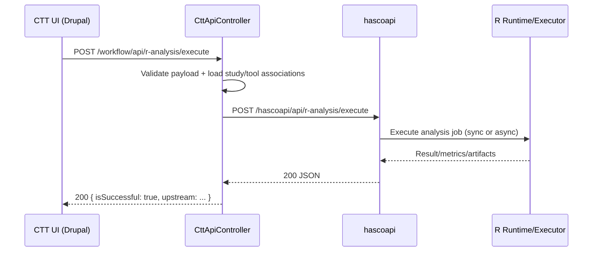

# HASCOAPI Handoff: Endpoint POST /hascoapi/api/r-analysis/execute

## 1) Objetivo
Este documento especifica, de forma operacional e contratual, o que a equipa da API precisa implementar/configurar para que a execucao real de R Analysis deixe de retornar 502 no Drupal (causado atualmente por 404 no upstream).

Contexto do problema observado:
- O Drupal chama o endpoint configurado em `ctt.settings.r_analysis_endpoint_path`.
- Valor default atual: `/hascoapi/api/r-analysis/execute`.
- Base URL efetiva usada pelo CTT: `rep.settings.api_url` (via modulo REP).
- Resultado atual da execucao real: HTTP 404 no hascoapi, que no Drupal aparece como 502 com `upstream_endpoint_not_found`.

## 2) Escopo e nao-escopo
Escopo deste handoff:
- Definir contrato HTTP do endpoint.
- Definir payload que o Drupal envia.
- Definir payload de resposta esperado para sucesso e erro.
- Definir requisitos de auth, timeout, logs, rastreabilidade e observabilidade.
- Definir testes de aceite.

Nao-escopo:
- Nao altera o Drupal para contornar a falta do endpoint.
- Nao muda o modelo de dados dos estudos/workflows no Drupal.

## 3) Fluxo atual (fonte de verdade)
1. Utilizador aciona R Analysis no CTT.
2. Drupal valida `studyUri`, `processUri`, `toolUri` e argumentos.
3. Drupal monta o payload final (`requestPayload`) e envia para hascoapi.
4. Se hascoapi retornar 2xx, Drupal devolve `isSuccessful=true` com `upstream`.
5. Se hascoapi falhar (404, timeout, etc.), Drupal devolve erro de execucao (hoje 502 para 404).



## 4) Requisitos obrigatorios no hascoapi
### 4.1 Endpoint
- Method: `POST`
- Path: `/hascoapi/api/r-analysis/execute`
- Content-Type request: `application/json`
- Content-Type response: `application/json`

### 4.2 Autenticacao
- Se JWT estiver ativo no ambiente, aceitar header `Authorization: Bearer <token>`.
- Em ambientes sem JWT, manter comportamento permissivo de acordo com politica local.
- Erros de auth devem ser `401` ou `403` com payload JSON explicito.

### 4.3 Timeout e comportamento
- O Drupal envia timeout HTTP (default 60s, configuravel no CTT).
- Endpoint deve responder dentro da janela configurada, ou devolver erro controlado JSON.
- Evitar timeouts silenciosos e HTML de erro generico.

### 4.4 Formato de erro
- Nao devolver pagina HTML em erro de API.
- Sempre devolver JSON estruturado com codigo/mensagem.

## 5) Payload que o Drupal envia (contrato de entrada)
O Drupal envia este formato para o hascoapi no POST:

```json
{
  "studyUri": "http://.../STD...",
  "processUri": "http://.../PC0...",
  "tool": {
    "toolUri": "http://.../workflow/tools/...",
    "name": "R Aspiration Secretion Risk Score",
    "version": "1.0.0",
    "language": "R",
    "artifactUri": "http://127.0.0.1/drupal/std/download-file/...",
    "artifactFilename": "ANALISE_R_ASPIRACAO_XXXXXX.R",
    "sourceRepositoryUri": "https://github.com/pydicom/pydicom",
    "entrypoint": "ANALISE_R_ASPIRACAO_XXXXXX.R"
  },
  "associations": {
    "datasets": [
      { "uri": "http://...", "label": "..." }
    ],
    "variables": [
      { "uri": "http://...", "label": "..." }
    ],
    "images": [
      { "filename": "IMG_CT_SMALL_XXXXXX.dcm", "label": "..." }
    ],
    "counts": {
      "datasets": 3,
      "variables": 6,
      "images": 1
    }
  },
  "arguments": {
    "requestTag": "execute",
    "invokedBy": "validate_full_aspiracao_scenario_drush.php"
  },
  "requestedAt": "2026-06-01T09:31:40+00:00",
  "requestedBy": {
    "uid": "0",
    "identifier": "automation@local.pmsr"
  }
}
```

Notas importantes:
- `tool.language` deve ser `R` (o Drupal ja valida isso).
- `associations` pode vir vazio em alguns cenarios; o Drupal pode sinalizar warning mas ainda executar.
- `artifactUri` aponta para download Drupal; a API pode usar isso para obter script/dados quando aplicavel.

## 6) Contrato de resposta recomendado (sucesso)
Para maximizar interoperabilidade e observabilidade, responder 200 com estrutura explicita:

```json
{
  "isSuccessful": true,
  "body": {
    "runId": "RA-20260601-0001",
    "status": "completed",
    "startedAt": "2026-06-01T10:50:00Z",
    "finishedAt": "2026-06-01T10:50:08Z",
    "durationMs": 8123,
    "engine": {
      "name": "Rscript",
      "version": "4.3.2"
    },
    "input": {
      "studyUri": "http://.../STD...",
      "processUri": "http://.../PC0...",
      "toolUri": "http://.../workflow/tools/..."
    },
    "outputs": [
      {
        "kind": "csv",
        "uri": "http://.../artifact/output_aspiracao_risco.csv",
        "filename": "output_aspiracao_risco.csv",
        "sizeBytes": 1890,
        "checksumSha256": "..."
      }
    ],
    "summary": {
      "records": 18,
      "highRisk": 2,
      "moderateRisk": 7,
      "lowRisk": 9
    },
    "logs": [
      "Loaded dataset with 18 rows",
      "Risk scoring completed"
    ]
  }
}
```

Observacao:
- O Drupal aceita tecnicamente qualquer JSON em 2xx, mas este formato deixa auditoria e troubleshooting muito melhores.

## 7) Contrato de resposta recomendado (erro)
### 7.1 Erro funcional (input invalido) - 400
```json
{
  "isSuccessful": false,
  "error": {
    "code": "invalid_payload",
    "message": "Missing tool.entrypoint",
    "details": [
      { "field": "tool.entrypoint", "message": "Required" }
    ]
  }
}
```

### 7.2 Erro de auth - 401/403
```json
{
  "isSuccessful": false,
  "error": {
    "code": "unauthorized",
    "message": "Missing or invalid bearer token"
  }
}
```

### 7.3 Erro de execucao R - 500/502
```json
{
  "isSuccessful": false,
  "error": {
    "code": "r_execution_failed",
    "message": "Rscript process exited with code 1",
    "details": {
      "stderr": "...",
      "runId": "RA-20260601-0001"
    }
  }
}
```

### 7.4 Timeout - 504 (ou 500 com codigo interno)
```json
{
  "isSuccessful": false,
  "error": {
    "code": "execution_timeout",
    "message": "Execution exceeded 60 seconds",
    "details": { "timeoutSeconds": 60 }
  }
}
```

## 8) Requisitos de implementacao (API)
### 8.1 Controller/route
- Registar rota POST exata `/hascoapi/api/r-analysis/execute`.
- Garantir parser JSON com tolerancia a campos adicionais.
- Validar campos minimos:
  - `studyUri` string nao vazia
  - `processUri` string nao vazia
  - `tool.toolUri`
  - `tool.language == "R"` (case-insensitive recomendado)

### 8.2 Executor
- Resolver script via `tool.artifactUri` + `tool.entrypoint`, ou estrategia local equivalente.
- Materializar datasets/associations necessarios (se aplicavel).
- Executar runtime R (Rscript/container/worker).
- Recolher stdout/stderr, exit code, tempo, artefatos gerados.

### 8.3 Persistencia/auditoria
- Gerar `runId` unico por requisicao.
- Persistir:
  - payload recebido (com mascaramento de segredos, se houver)
  - timestamps de inicio/fim
  - status final
  - logs de execucao
  - metadata de output

### 8.4 Observabilidade
- Logs estruturados por `runId`, `studyUri`, `processUri`, `toolUri`.
- Metricas recomendadas:
  - contagem de chamadas
  - tempo medio/p95
  - taxa de sucesso
  - taxa de timeout

## 9) Compatibilidade e configuracao
Parametros relevantes no Drupal CTT:
- `r_analysis_endpoint_path` (default `/hascoapi/api/r-analysis/execute`)
- `r_analysis_timeout_seconds` (default `60`)
- `disable_ssl_verification` (apenas dev)
- `jwt_key_id` (opcional para auth JWT)

A API deve considerar que a base URL vem de `rep.settings.api_url`; o CTT concatena base + path.

## 10) Testes de aceite (obrigatorios)
### 10.1 Smoke test HTTP
- POST com payload valido retorna 200 JSON.
- POST com payload invalido retorna 400 JSON.
- Endpoint inexistente nao deve acontecer apos deploy.

### 10.2 Integração com Drupal
Criterios para considerar resolvido:
- Em validacao automatica, `R_VALIDATE_STATUS=200` e `R_VALIDATE_IS_SUCCESSFUL=true`.
- Em execucao real, `R_EXECUTE_STATUS=200` e `R_EXECUTE_IS_SUCCESSFUL=true`.
- No runner consolidado, `stageSummary.rExecute=true`.

### 10.3 Regressao
- Nao quebrar endpoints existentes do hascoapi.
- Nao retornar HTML para erros de API.

## 11) Comandos uteis para o colega da API
### 11.1 Exemplo curl (ajustar token/base URL)
```bash
curl -X POST "http://localhost:9000/hascoapi/api/r-analysis/execute" \
  -H "Content-Type: application/json" \
  -H "Accept: application/json" \
  -H "Authorization: Bearer <jwt_if_required>" \
  -d @payload.json
```

### 11.2 Payload de referencia real (gerado automaticamente)
- O bootstrap grava um payload pronto em `private://std/<study>/da/DA_R_ANALYSIS_PAYLOAD_<token>.json`.
- Esse payload pode ser usado como base para teste end-to-end.

## 12) Diagnostico atual (estado observado)
Ultima evidencia valida:
- `R_VALIDATE_STATUS=200` (validacao Drupal ok)
- `R_EXECUTE_STATUS=502`
- causa raiz: upstream `POST /hascoapi/api/r-analysis/execute` retorna `404 Not Found`

Conclusao:
- O bloqueio para sucesso real nao esta no frontend/Drupal.
- O bloqueio esta na ausencia/mapeamento incorreto do endpoint no hascoapi.

## 13) Definicao de pronto (DoD)
Considerar concluido quando:
- Endpoint implementado e publicado no hascoapi com contrato JSON.
- Testes de aceite acima aprovados.
- Runner unico do Drupal passa com `rExecute=true`.
- Evidencia JSON final sem blocker de R execute.

## 14) Anexo: notas de interoperabilidade
- O CTT encapsula o retorno da API no campo `upstream`; quanto mais estruturado o retorno da API, melhor a rastreabilidade no UI e em auditorias.
- Recomendado manter estabilidade de chaves: `runId`, `status`, `outputs`, `summary`, `error.code`, `error.message`.
- Em caso de execucao assíncrona futura, pode-se devolver `202 Accepted` com `runId` e endpoint de poll, mas isso exigira alinhamento com o fluxo atual do Drupal.
